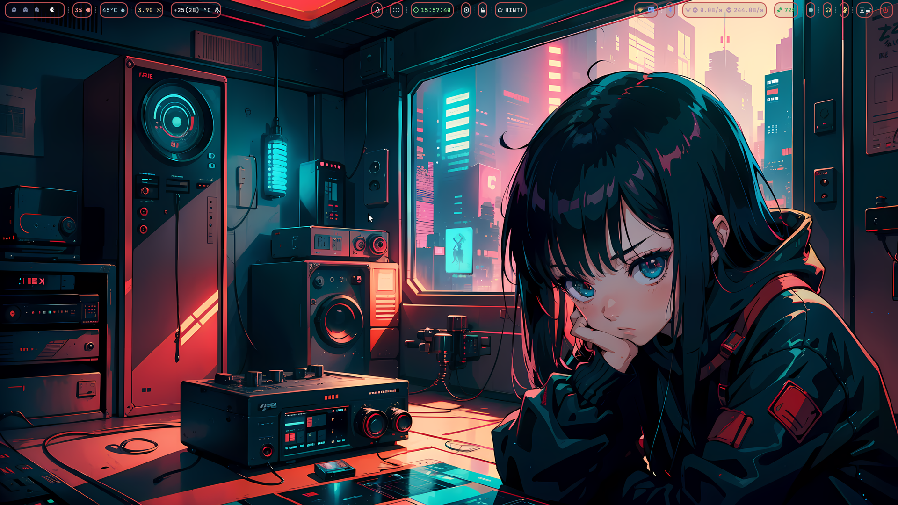
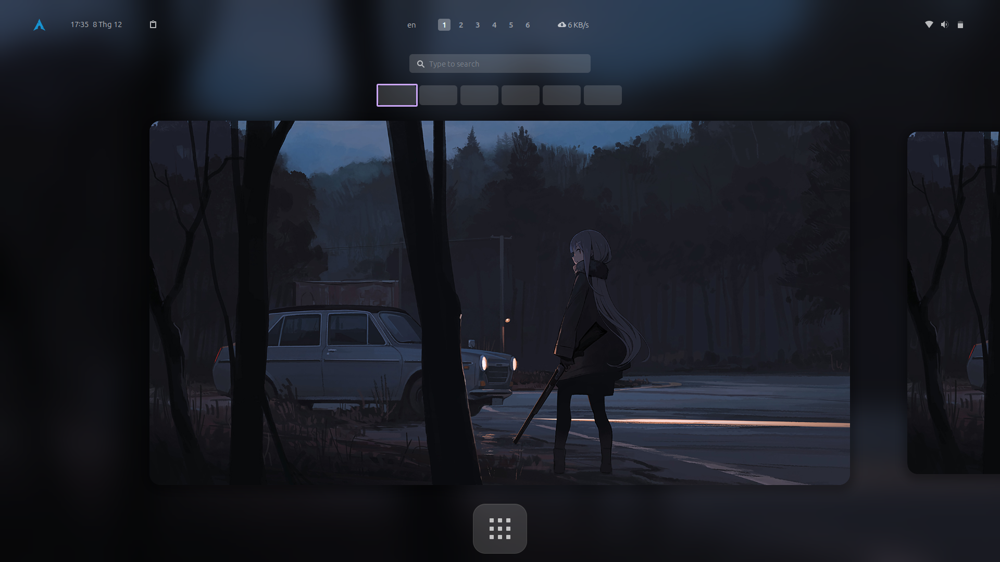
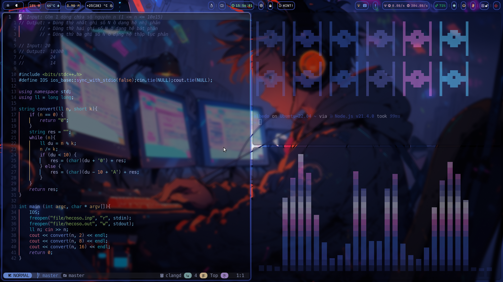

<div align="center">
    <h1>Overview 💫</h1>
</div>



## Window setup

- Necessary fonts:
  - [MesloLGS NF Regular.ttf](https://github.com/romkatv/powerlevel10k-media/raw/master/MesloLGS%20NF%20Regular.ttf)
  - [MesloLGS NF Bold.ttf](https://github.com/romkatv/powerlevel10k-media/raw/master/MesloLGS%20NF%20Bold.ttf)
  - [MesloLGS NF Italic.ttf](https://github.com/romkatv/powerlevel10k-media/raw/master/MesloLGS%20NF%20Italic.ttf)
  - [MesloLGS NF Bold Italic.ttf](https://github.com/romkatv/powerlevel10k-media/raw/master/MesloLGS%20NF%20Bold%20Italic.ttf)

```
Set-ExecutionPolicy RemoteSigned -Scope CurrentUser
irm https://is.gd/nhattruongNeoVim_window | iex
```

## Ubuntu setup

```bash
sudo apt install curl -y
bash <(curl -sSL https://is.gd/nhattruongNeoVim_ubuntu)
```

## Gnome configs



- GTK Icons: [Candy icons ](https://github.com/EliverLara/candy-icons)

- GRUB Themes (For dual boot user): [Gnome Grub Theme](https://www.gnome-look.org/p/2076542)

- GTK Themes (Base on): [(Modded) Catppuccin-Mocha-Standard-Mauve-Dark](https://github.com/ART3MISTICAL/dotfiles)

- [Gnome Shell Extensions](https://extensions.gnome.org/):

  - [Aylur's Widget](https://extensions.gnome.org/extension/5338/aylurs-widgets/): Beautiful Plugins with customizable bar
  - [Blur My Shell](https://extensions.gnome.org/extension/3193/blur-my-shell/): Blur the gnome shell
  - [Clipboard History](https://extensions.gnome.org//extension/4839/clipboard-history/): Simple clipboard for gnome
  - [Compiz alike magic lamp effect](https://extensions.gnome.org/extension/3740/compiz-alike-magic-lamp-effect/): Magic lamp effect alike the macOS minimize effect
  - [Compiz windows effect](https://extensions.gnome.org//extension/3210/compiz-windows-effect/): Compiz wobbly windows effect
  - [Coverflow Alt-Tab](https://extensions.gnome.org//extension/3210/compiz-windows-effect/): Replacement of Alt-Tab, iterates through windows in a cover-flow manner.
  - [Logo menu](https://extensions.gnome.org//extension/4451/logo-menu/): Menu similar to Apple's macOS menu for the GNOME Desktop
  - [No activities button](https://extensions.gnome.org//extension/3184/no-activities-button/): Hide the activities button
  - [Remove App Menu](https://extensions.gnome.org//extension/3906/remove-app-menu/): Remove the application menu from the top bar
  - [Rounded Window Corners](https://extensions.gnome.org/extension/5237/rounded-window-corners/): Rounded corners for all windows
  - [Search Light](https://extensions.gnome.org//extension/5489/search-light/): Take the apps search out of overview
  - [Space Bar](https://extensions.gnome.org//extension/5090/space-bar/): Replaces the 'Activities' button with an i3-like workspaces bar
  - [Top Bar Organizer](https://extensions.gnome.org//extension/4356/top-bar-organizer/): Organize the items of the top (menu)bar
  - [User Themes](https://extensions.gnome.org/extension/19/user-themes/): Load shell themes from user directories
  - [Vitals](https://extensions.gnome.org/extension/1460/vitals/): A simple system monitor on the top bar

- Copy config file:

  > By default, this script will be auto copy config file to ~/.config, it also add fonts, themes and icons which you can change by gnome-tweaks.

  ```zsh
  bash <(curl -sSL https://is.gd/nhattruongNeoVim_gnome)
  ```

  > However, you can you GNU stow if you want.

  ```
  git clone -b gnome https://github.com/nhattruongNeoVim/dotfiles.git ~/dotfiles --depth 1
  cd dotfiles && stow home
  ```

- Gnome tweaks (for apply themes and icons ) installation:

  ```zsh
  sudo apt update && sudo apt upgrade
  sudo apt install gnome-tweaks
  ```

  > Then open Tweaks:
  >
  > - Go to Appearance -> Applications -> (Modded) Catppuccin-Mocha-Standard-Mauve-Dark
  > - Go to Appearance -> Shell -> (Modded) Catppuccin-Mocha-Standard-Mauve-Dark
  > - Go to Appearance -> Icons -> Candy-icons

## Hyprland config



- Hyprland on ubuntu: [JaKooLit/Debian-Hyprland](https://github.com/JaKooLit/Debian-Hyprland)

- Hyprland on arch: [JaKooLit/Arch-Hyprland](https://github.com/JaKooLit/Arch-Hyprland)

```bash
# Then run this command
sudo apt install curl -y
bash <(curl -sSL https://is.gd/nhattruongNeoVim_hyprland)
```

> [!Note]
> The auto copy script will create backups of intended folders to be copied. However, still a good idea to manually backup just incase script failed to backup!

- ~/.config (btop cava dunst hypr kitty rofi swappy swaylock waybar wlogout) - These are folders to be copied.
- ~/Pictures/wallpapers - Will be backed up
- clone this repo by using git. Change directory, make executable and run the script

```bash
git clone https://github.com/nhattruongNeoVim/dotfiles ~/dotfiles --depth 1
cd ~/dotfiles && chmod +x hyprland.sh && ./hyprland.sh
```

**Congratulations!** at this point you successfully have configured your linux distribution.

# (￣ y▽ ￣)╭ Ohohoho.....

<!-- https://is.gd/nhattruongNeoVim_nvim -->
<!-- https://is.gd/nhattruongNeoVim_hyprland -->
